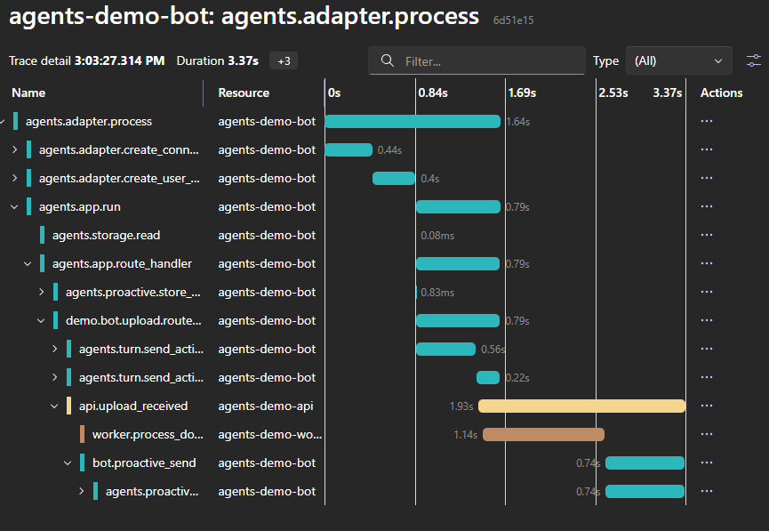

# Distributed Tracing in Agent Workflows with Agents SDK v1.5 and OpenTelemetry

## When a bot is more than a bot

Modern agents don’t run in isolation.
A single user interaction can fan out across APIs, background workers, and eventually return as a proactive notification — often asynchronously.
When something goes wrong (or just gets slow), the hardest question isn’t what happened, but where it happened.
That’s where distributed tracing becomes essential.

Agents SDK v1.5 adds first-class support for OpenTelemetry. This post walks through a sample that puts it to work across three services, and shows how proactive messaging fits naturally into the same trace.


## What's new in Agents SDK v1.5

These features are not just additive—they remove two common sources of complexity when building observable agent systems.

**OpenTelemetry bootstrap (manual `instrumentation.ts`)**

Each service bootstraps OpenTelemetry through a dedicated `instrumentation.ts` module that is preloaded before `index.ts` using Node's `--import` flag. This gives full control over exporters, metric intervals, and shutdown handlers — without relying on `@microsoft/agents-telemetry` or auto-instrumentation packages. Wire up OTLP exporters once at startup and the SDK instruments itself. Propagation across service boundaries is explicit (inject/extract), which is the main pattern this sample demonstrates.

**Proactive messaging (`AgentApplication.proactive`)**

Sending a message outside of an active user turn used to require managing conversation references manually. The v1.5 SDK removes the need for manual conversation reference handling, making proactive messaging a first-class capability:

```typescript
// During a live user turn — store the conversation reference
const convId = await app.proactive.storeConversation(ctx);

// Later, out-of-turn — send a message to that conversation
await app.proactive.sendActivity(adapter, convId, { text: 'Processing complete!' });
```

These two features pair well: you can kick off async work, trace it end-to-end, and deliver results back to the user proactively.


## The sample: upload → process → notify

The repo implements one end-to-end scenario across three containers:

1. User sends `upload <filename>` in the Agents Playground
2. **Bot** stores the conversation and fires a **fire‑and‑forget** request to the API, so the bot responds immediately while processing continues asynchronously
3. **API** forwards the work to the Worker
4. **Worker** simulates processing (1–3 s), possibly failing with HTTP 500
5. **API** notifies the Bot with the result
6. **Bot** sends a proactive message back to the user

Three services. One trace. One place to understand the full lifecycle.

This is especially relevant in systems where agents orchestrate multiple services, handle asynchronous workflows, or integrate with external APIs.

## The key challenge: explicit trace propagation

The hardest part of distributed tracing is not instrumentation — it’s **trace context propagation across service boundaries**.

OpenTelemetry uses the W3C Trace Context standard: a `traceparent` header carries the `traceId` and `spanId` from one service to the next.
When the traceparent header is missing (or not forwarded), each service starts a new trace. That’s why your waterfall disappears.

Most tracing issues in distributed systems are not caused by missing instrumentation, but by missing propagation.

**Inject on the way out:**

```typescript
const traceHeaders: Record<string, string> = {};
propagation.inject(context.active(), traceHeaders);
await axios.post(url, body, { headers: traceHeaders });
```

**Extract on the way in:**

```typescript
const parentContext = propagation.extract(context.active(), req.headers);
tracer.startActiveSpan('my.span', {}, parentContext, async (span) => {
  // this span is a child of the caller's span — same traceId
});
```

This is a small amount of code — but it is what makes a unified trace possible. If you're new to OpenTelemetry and your traces appear fragmented across services, this is almost certainly the reason.

For the proactive send — which happens outside any active HTTP handler — the extracted context is passed through `context.with()` so those spans still join the right trace:

```typescript
await context.with(parentContext, async () => {
  await app.proactive.sendActivity(adapter, convId, activity);
});
```

The [observability.md](./observability.md) doc in the repo covers the full pattern with the exact implementation for each service boundary.
This pattern reflects scenarios we’ve encountered when building multi-service agent systems in production environments.


## What you see in Aspire Dashboard

 

> Tip: collapse or filter internal messaging spans (e.g., adapter/send activities) to highlight the cross-service boundaries and long-running worker span.

A single traceId spanning bot, API, and worker, including the proactive message — even across asynchronous boundaries.
- [bot] demo.bot.upload.route_handler
- [api] api.upload_received
- [worker] worker.process_document (~1–3 s)
- [bot] bot.proactive_send


All spans across the three services share the same `traceId`, forming a single trace instead of disconnected fragments. Each span exposes duration, attributes, and errors — turning what would otherwise be guesswork into traceable, debuggable behavior.

The sample also includes:

- A **failure path** (`upload fail-demo.pdf`) that generates ERROR spans and a recorded exception — useful for seeing what a real error looks like in a distributed trace
- A **histogram metric** (`demo.worker.processing.duration.ms`) recorded by the worker, so you have traces and metrics together in the same dashboard

## Why this matters for bot developers

Proactive messaging is common in real agent workloads: long‑running operations, background processing, delayed responses.
Without trace continuity, these workflows become difficult to debug and reason about.

The pattern shown here ensures that:
- asynchronous work stays connected to the originating interaction
- failures are traceable end‑to‑end
- proactive notifications are not “invisible events” but part of the same observable lifecycle

For architects, this turns async agent workflows into something you can reason about as a single transaction boundary—even when execution is distributed.

---

## Try it yourself

If you're working on multi-service agents, background processing, or proactive messaging scenarios, the best way to understand this pattern is to run it and inspect the traces directly.

Clone the repo, run the services, and trigger a few upload commands from the Agents Playground. Then open Aspire Dashboard and follow the trace.

The full source code is available here: https://github.com/southworks/agents-sdk-v15-otel-proactive
